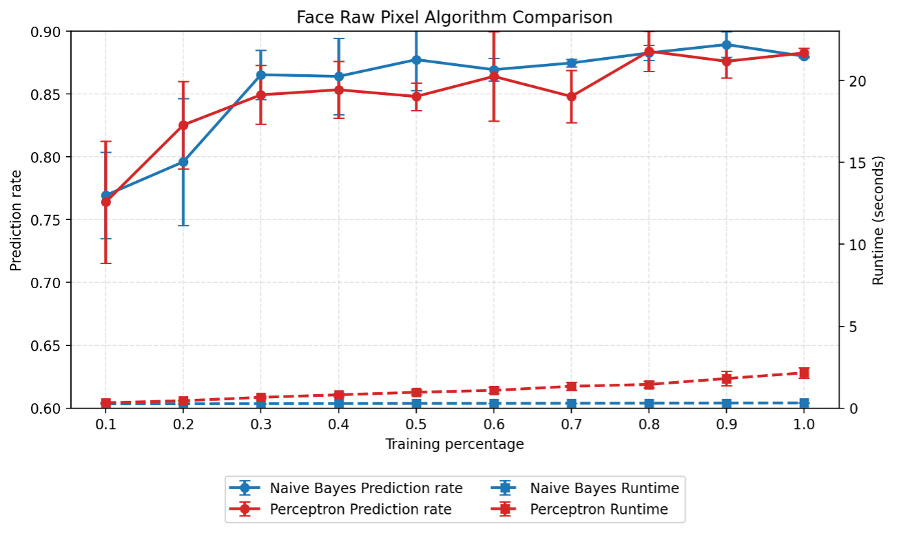
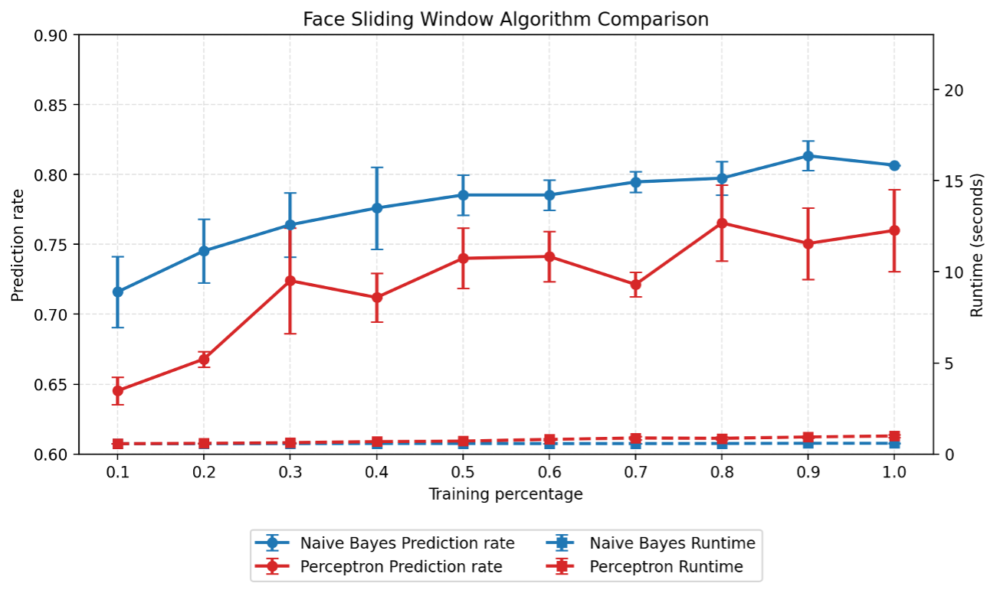
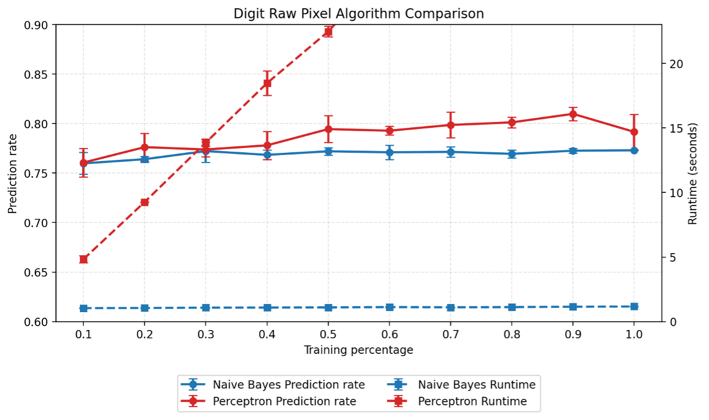
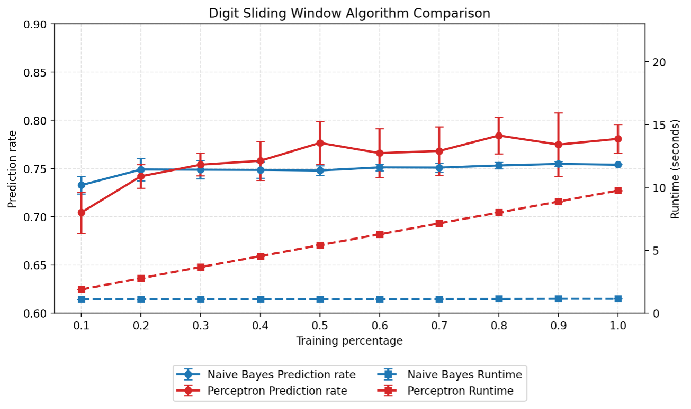

# Image Classification: Naive Bayes vs. Perceptron

A from-scratch implementation and experimental comparison of Naive Bayes and Perceptron classifiers for image classification.

This project evaluates how classifier choice, feature representation, and training-set size affect classification accuracy and runtime across two image datasets: handwritten digits and faces.

Rather than relying on machine-learning libraries for the classifiers, the project implements the learning and prediction algorithms directly in Python and evaluates them through repeated experiments.

## Project Overview

The study compares:

- **Naive Bayes** and **Perceptron** classification
- **Face detection** and **handwritten digit recognition**
- **Raw-pixel** and **sliding-window** feature representations
- Training-set sizes ranging from **10% to 100%**
- Classification accuracy and execution time across repeated trials

Each experimental configuration is run five times, allowing both average performance and variability between runs to be measured.

## Classifiers

### Naive Bayes

The project implements a Bernoulli Naive Bayes classifier for binary image features.

During training, the classifier learns class-prior probabilities and the conditional probability of each feature being active for each class. Smoothing is applied to prevent zero-probability features.

During prediction, class scores are calculated using log probabilities, and the class with the highest score is selected.

The implementation supports:

- 2 classes for face classification
- 10 classes for handwritten digit classification

### Perceptron

The project also implements a multiclass linear Perceptron classifier.

A separate weight vector and bias are maintained for each class. During training, the weights are updated when the classifier makes an incorrect decision. Training continues until the weights converge or the maximum number of training passes is reached.

Prediction evaluates the linear score for each class and selects the class with the highest score.

## Feature Representations

Two feature-extraction strategies are evaluated to determine how the representation of an image affects classifier performance.

### Raw-Pixel Features

The raw-pixel representation converts each ASCII image directly into a binary feature vector.

- A blank space is represented as `0`.
- Any non-space character is represented as `1`.
- Each pixel position becomes an individual feature supplied to the classifier.

This representation preserves the full spatial resolution of the original image.

### Sliding-Window Features

The sliding-window representation reduces the image into a smaller set of local features.

A **3 × 3 window** moves across the binary image with a **stride of 2**. For each window, the number of active pixels is counted:

- More than 3 active pixels → `1`
- 3 or fewer active pixels → `0`

This produces a more compact feature vector and provides an experimental comparison between retaining individual pixels and representing local regions of the image.

## Experimental Design

The experiment evaluates every combination of:

- 2 classifiers: Naive Bayes and Perceptron
- 2 datasets: faces and handwritten digits
- 2 feature representations: raw pixels and sliding windows
- 10 training-set sizes: 10% through 100%

Each configuration is executed **five times** using randomly sampled training subsets.

Across a complete experiment, this produces **80 configurations and 400 individual classifier runs**.

For each configuration, the program records:

- Average classification accuracy
- Standard deviation of classification accuracy
- Average runtime
- Standard deviation of runtime

The complete experimental measurements are stored in `all_results.csv`.

## Results

The experiments show how classifier choice, feature representation, and the amount of available training data affect both prediction accuracy and runtime.

Across the recorded experiments, the highest observed mean accuracies for each classifier and dataset were:

| Classifier | Dataset | Feature Representation | Training Data | Mean Accuracy |
| --- | --- | --- | ---: | ---: |
| Naive Bayes | Faces | Raw Pixel | 90% | 88.93% |
| Naive Bayes | Digits | Raw Pixel | 100% | 77.30% |
| Perceptron | Faces | Raw Pixel | 80% | 88.40% |
| Perceptron | Digits | Raw Pixel | 90% | 80.98% |

These values represent the highest mean accuracy observed in the recorded trials rather than a claim that the corresponding training percentage is universally optimal.

### Face Classification — Raw Pixels

### Face Classification — Sliding Window

### Digit Classification — Raw Pixels

### Digit Classification — Sliding Window

## Key Observations

- Raw-pixel features produced the highest observed mean accuracy for both classifiers on both datasets.
- Naive Bayes and Perceptron achieved similar peak mean accuracy on the face dataset in the recorded experiments.
- On the digit dataset, the highest observed Perceptron mean accuracy exceeded the highest observed Naive Bayes mean accuracy.
- Increasing the amount of training data generally increases the computational work required, making runtime an important consideration alongside classification accuracy.
- The sliding-window representation reduces the number of features supplied to the classifiers, providing a way to examine the tradeoff between a more compact representation and predictive performance.

## Project Structure

    Image_Class/
    ├── run_all_statistics.py
    ├── naive_bayes_train.py
    ├── naive_bayes_prediction.py
    ├── naive_bayes_test.py
    ├── naive_bayes_validation.py
    ├── perceptron_train.py
    ├── perceptron_prediction.py
    ├── perceptron_test.py
    ├── perceptron_validation.py
    ├── raw_pixel_feature_extraction.py
    ├── sliding_window_feature_extraction.py
    ├── cs4346-image-data/
    ├── results/
    ├── all_results.csv
    ├── Image_Classification_Report.pdf
    └── README.md

The classifier implementations are separated into training, prediction, validation, and testing components. Feature extraction is handled independently so that the same classifiers can be evaluated using different image representations.

## Running the Experiments

This project uses Python 3 and the image datasets included in the repository.

Clone the repository:

    git clone https://github.com/PatzerATX/Image_Class.git
    cd Image_Class

Run the complete experiment:

    python3 run_all_statistics.py

The experiment runs every classifier, dataset, feature-representation, and training-size combination five times.

When complete, the aggregated results are written to:

    all_results.csv

Because the complete experiment performs 400 classifier runs, execution time can vary substantially depending on the system.

## Technologies and Concepts

**Language**
- Python

**Machine Learning**
- Bernoulli Naive Bayes
- Multiclass Perceptron
- Supervised learning
- Image classification
- Feature extraction
- Training and test datasets

**Experimental Analysis**
- Training-set sampling
- Repeated trials
- Accuracy measurement
- Runtime measurement
- Standard deviation
- Comparative performance analysis

## Full Report

For the complete methodology, experimental results, runtime and prediction-rate graphs, and analysis, see the [Image Classification Report](Image_Classification_Report.pdf).
